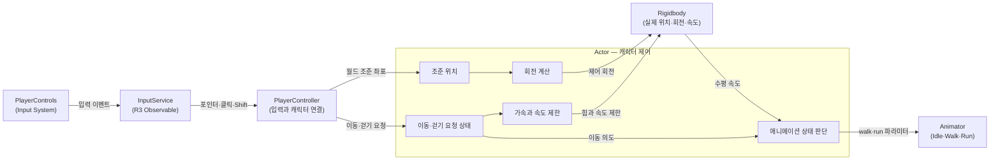

# 1번째 작업 기록

- 현재 단계: 캐릭터 움직이기 → 캐릭터 애니메이션
- 대상 프로젝트: `UmamusumeTracenFarm`
- 사용 캐릭터: 스페셜 위크 MINI

## 오늘의 목표

추출과 조립이 끝난 MINI 캐릭터를 실제 게임 캐릭터로 움직이고, 이동 상태에 맞춰 Idle·Walk·Run 애니메이션을 전환하는 기본 흐름을 만든다.

## 선행 기반

- 스페셜 위크 MINI 모델과 의존 리소스가 Unity 프로젝트로 조립되어 있다.
- Idle, Walk, Run 애니메이션 클립과 Animator Controller가 준비되어 있다.
- 프로젝트는 Unity 6000.5.7f1과 URP 17.5.0을 사용한다.
- 캐릭터 Animator의 Root Motion은 꺼져 있으며, 실제 위치 이동은 Rigidbody가 담당한다.

## 주요 작업 행적

### 1. 프로젝트 환경 확인

- Unity 프로젝트 경로에 한글이 포함될 때 `UnityEditor.QuickInstall`의 어셈블리 경로 변환 과정에서 오류가 발생할 수 있음을 확인했다.
- Graphics Settings에 URP 에셋이 연결된 것을 확인했다.
- URP와 카메라에 4x MSAA가 적용되어 있지만, 이동 테스트 씬 카메라의 후처리 안티앨리어싱은 꺼져 있음을 확인했다.
- 화면의 자글거림은 기하 경계뿐 아니라 셰이더, 알파, 텍스처와 시간축 깜빡임에서도 발생할 수 있음을 구분했다.

관련 노트:

- [Unity 에디터와 프로젝트 환경](../categories/Unity_에디터와_프로젝트_환경.md)
- [URP와 안티앨리어싱 설정 확인](../URP와_안티앨리어싱_설정_확인.md)

### 2. 입력 계층 구성

- Input System의 `PlayerControls`를 입력 원본으로 사용했다.
- `InputService`가 Input Action 이벤트를 받아 Observable로 외부에 전달하도록 구성했다.
- `PlayerController`가 입력을 구독하고 게임 캐릭터인 `Actor`에 이동·조준·걷기 요청을 전달하도록 역할을 나눴다.
- 포인터 화면 좌표를 카메라 Ray와 지면 Plane의 교점으로 변환해 캐릭터가 바라볼 월드 좌표를 계산했다.
- 마우스 왼쪽 버튼의 누름과 해제로 이동 요청 상태를 전달했다.
- Shift를 누르는 동안 걷게 하기 위해 Interact와 분리된 Button Action을 추가했다.

현재 입력 전달 흐름:

`PlayerControls → InputService → PlayerController → Actor`

### 1번째 시스템 구조



구조의 핵심은 입력 계층이 Rigidbody나 Animator를 직접 조작하지 않고, `Actor`가 이동·회전·표현 상태를 결정하도록 책임을 모은 것이다. Animator는 입력 키가 아니라 `Actor`가 판단한 실제 이동 상태를 전달받는다.

### 3. Rigidbody 기반 캐릭터 이동

- 이동 요청이 있는 동안 캐릭터 전방으로 가속도를 적용했다.
- 수평 이동 속도만 제한하고 중력으로 생긴 Y축 속도는 보존했다.
- 조준 지점에 가까워지거나 이동 요청이 해제되면 수평 이동을 정지하도록 했다.
- 기본 이동과 Shift 걷기에 서로 다른 최대 속도를 사용하도록 분리했다.
- 현재 설정값은 기본 이동 최대 속도 5, 걷기 최대 속도 1.5다.

### 4. 캐릭터 회전

- 캐릭터 위치에서 조준 지점으로 향하는 수평 방향을 목표 방향으로 사용했다.
- 목표 방향을 향해 일정한 각속도로 부드럽게 회전하도록 했다.
- 물리 충돌이 만든 회전과 플레이어가 제어하는 회전을 분리하기 위해 논리적 회전 상태를 별도로 보관했다.
- 충돌로 생긴 각속도를 제거하고, 입력으로 계산한 회전을 Rigidbody에 다시 적용했다.

핵심 구분:

- 조준 위치: 어디를 바라볼 것인가
- 목표 회전: 조준 위치에서 계산한 최종 방향
- 제어 회전: 현재까지 회전한 진행 상태
- Rigidbody 회전: 충돌 등 물리 계산의 영향을 받을 수 있는 실제 상태

### 5. Idle·Walk·Run 애니메이션 연결

- Animator에 `walk`, `run` bool 파라미터가 존재하는 것을 확인했다.
- 수직 속도를 제외한 실제 수평 속도로 이동 애니메이션을 판단했다.
- 이동 요청과 실제 속도가 모두 있을 때 이동 애니메이션을 활성화했다.
- 낮은 이동 속도에서는 Walk, 높은 이동 속도에서는 Run으로 전환하도록 했다.
- Idle, Walk, Run 사이의 전환에서 Has Exit Time이 꺼져 있어 입력과 속도 변화에 즉시 반응하도록 구성했다.
- 같은 Animator bool 값을 매 프레임 전달해도 애니메이션이 처음부터 재시작되는 것은 아님을 확인했다.

### 6. Shift 걷기 연결

- Shift 입력의 `performed`와 `canceled`를 모두 구독했다.
- 누르고 있는 동안 걷기 요청을 활성화하고, 뗄 때 해제하도록 했다.
- 걷기 요청이 활성화되면 수평 최대 속도를 낮추도록 했다.
- Shift는 Interact의 대체 키가 아니라 이동 방식을 바꾸는 별도 의미이므로 독립 Action으로 다뤄야 함을 확인했다.

## 핵심 코드 예시

아래 코드는 1번째 구현 전체가 아니라, 각 처리의 중심 개념만 다시 확인하기 위한 축약 예시다.

### 입력 상태 전달

Shift의 누름과 해제를 같은 경로로 전달하면 캐릭터는 걷기 요청을 bool 상태로 보관할 수 있다.

```csharp
private void OnWalk(InputAction.CallbackContext context)
{
    _walk.OnNext(context.ReadValueAsButton());
}
```

### 조준 위치로 목표 회전 계산

조준 위치는 목표 방향을 만들고, 별도로 보관한 제어 회전은 부드러운 회전의 현재 진행 상태가 된다.

```csharp
Vector3 direction = _aimPosition - _rigidbody.position;
direction.y = 0f;

Quaternion targetRotation = Quaternion.LookRotation(direction);
_controlledRotation = Quaternion.RotateTowards(
    _controlledRotation,
    targetRotation,
    _turnSpeed * Time.fixedDeltaTime);
```

### 걷기 요청에 따른 목표 최고 속도 선택

걷기 요청은 이동 방향을 바꾸지 않고 사용할 최고 속도만 선택한다.

```csharp
float maxSpeed = _walkRequested
    ? _maxWalkSpeed
    : _maxMoveSpeed;
```

이 선택 자체는 정상이나, 현재 구현은 AddForce가 실제 물리 시뮬레이션에 반영되는 시점 때문에 최종 속도가 선택한 최대값을 초과할 수 있다. 속도 제한 방법은 2번째 기록에서 다시 다룬다.

### 애니메이션용 수평 속도 추출

낙하나 경사 반응으로 생기는 수직 속도를 보행 애니메이션 판단에서 제외한다.

```csharp
Vector3 horizontalVelocity = _rigidbody.linearVelocity;
horizontalVelocity.y = 0f;
```

현재 구현은 이 수평 속도와 이동 요청을 함께 사용해 Idle·Walk·Run을 판단한다. 시작과 종료 임계값을 다르게 적용하는 히스테리시스는 아직 반영되지 않았다.

## 작업 로그와 검증 결과

### Git 기록

- 커밋: `b6378c6f1519073cdc8c06132475054b82f1d1ae`
- 커밋 메시지: `캐릭터 움직이기 처리`
- 커밋 시각: 2026-08-18 18:30:31 +09:00
- 캐릭터 이동, 입력 서비스와 플레이어 컨트롤러의 기본 구성이 기록되었다.

### 빌드 검증

- `Assembly-CSharp.csproj` 빌드 성공
- 경고 0개
- 오류 0개

### 자산 설정 검증

- Animator에 Idle, Walk, Run 상태가 존재한다.
- `walk`, `run` bool 파라미터가 코드와 동일한 이름으로 존재한다.
- 상태 간 전환 조건이 연결되어 있다.
- Root Motion이 비활성화되어 Rigidbody 이동과 중복되지 않는다.

## 검수에서 발견된 미해결 항목

### 1. 최고 속도 제한과 AddForce 적용 시점

가장 먼저 해결해야 할 항목이다.

현재는 가속도를 누적한 뒤 같은 FixedUpdate에서 현재 속도를 제한한다. 그러나 AddForce의 효과는 FixedUpdate가 끝난 다음 물리 시뮬레이션에서 적용된다. 따라서 제한한 속도 위에 누적된 속도 변화가 다시 더해져 실제 속도가 설정한 최대값보다 높아질 수 있다.

현재 수치와 기본 물리 간격을 기준으로 하면 걷기 제한 1.5에 한 틱당 약 0.6의 속도 변화가 더해질 가능성이 있다. 애니메이션은 제한 직후의 속도를 보고 Walk를 선택하지만, 실제 이동은 더 빠르게 진행되어 발 미끄러짐이 생길 수 있다.

참고: [Unity Rigidbody.AddForce](https://docs.unity3d.com/ja/current/ScriptReference/Rigidbody.AddForce.html)

### 2. 애니메이션 시작·종료 임계값

- 걷기 시작 속도 상수가 선언되어 있지만 실제 판단에 사용되지 않는다.
- 현재는 정지 판정용 속도 하나가 Walk 시작과 종료에 모두 사용된다.
- 속도가 임계값 근처에서 흔들리면 Idle과 Walk가 반복 전환될 수 있다.
- 시작 임계값과 종료 임계값을 분리해 히스테리시스를 적용하는 방법을 학습해야 한다.
- Run 전환도 경계 속도에서 흔들릴 가능성이 있는지 함께 확인한다.

### 3. 디버그 로그 정리

- 수평 속도 로그가 FixedUpdate마다 출력되고 있다.
- 포인터 위치 로그도 입력이 갱신될 때마다 출력된다.
- 확인이 끝나면 빈번한 로그를 제거하거나 필요한 경우에만 켤 수 있도록 정리한다.

### 4. Input Action 이름 정리

- 현재 걷기 Action 이름은 `Interact - walk`이며 생성된 API 이름은 `Interactwalk`다.
- 기능은 동작하지만 의미가 불명확하므로 `Walk` 또는 `WalkModifier`로 정리하는 것이 좋다.

## 오늘 학습한 핵심 내용

### 입력과 행동의 분리

- 입력 키 자체가 아니라 행동의 의미를 Action 이름으로 표현한다.
- 같은 Action의 여러 Binding은 일반적으로 같은 행동을 실행하는 대체 입력이다.
- 서로 다른 의미의 입력은 별도 Action으로 나누는 편이 리바인딩과 유지보수에 유리하다.

### 입력 의도와 실제 상태의 분리

- 이동 버튼을 누른 것은 이동 의도다.
- Rigidbody의 수평 속도는 실제 이동 상태다.
- 벽에 막혔을 때처럼 이동 의도와 실제 움직임은 다를 수 있다.
- 애니메이션은 실제 상태를 중심으로 판단하되, 충돌에 떠밀린 움직임을 보행으로 볼 것인지 결정하기 위해 이동 의도를 함께 사용할 수 있다.

### 논리 상태와 물리 상태의 분리

- 제어 회전은 플레이어가 만들고자 하는 상태다.
- Rigidbody 회전은 물리 엔진이 계산한 실제 상태다.
- 충돌 반응이 다음 제어 계산의 기준에 섞이면 캐릭터 방향이 흔들릴 수 있으므로 두 상태를 분리할 수 있다.

### 물리 틱과 렌더 프레임의 차이

- FixedUpdate는 물리 계산을 요청하는 시점이며, 그 안에서 호출한 AddForce가 즉시 최종 이동 결과가 되는 것은 아니다.
- 물리 시뮬레이션이 실제로 속도와 위치를 갱신하는 시점을 고려해야 한다.
- 이동 속도 제한과 애니메이션 샘플링 시점이 다르면 시각적 상태와 실제 이동이 어긋날 수 있다.

### Animator 파라미터의 성격

- Animator bool은 애니메이션을 직접 다시 재생하는 명령이 아니라 상태 전환 조건으로 사용하는 값이다.
- 같은 값을 반복 설정해도 일반적인 상태 전환에서는 클립이 매 프레임 재시작되지 않는다.
- 즉각적인 이동 상태 전환에는 Has Exit Time, 전환 시간과 전환 조건을 함께 확인해야 한다.

## 주요 용어

| 용어 | 의미 |
|---|---|
| Input Action | 게임에서 수행할 행동을 표현하는 입력 단위 |
| Binding | 키나 버튼 같은 실제 장치를 Input Action에 연결한 것 |
| performed | 입력이 Action의 수행 조건을 만족한 시점 |
| canceled | 눌림 해제 등으로 Action이 더 이상 수행 상태가 아닌 시점 |
| Observable | 값의 변경을 구독자에게 전달하는 스트림 |
| Subject | 값을 외부에서 발행할 수 있는 Observable |
| DI | 객체가 필요한 의존성을 외부에서 전달받는 구조 |
| Ray | 시작점과 방향으로 표현되는 반직선 |
| Plane | 지면과 같은 무한 평면을 나타내는 구조 |
| Aim Position | 캐릭터가 바라보도록 지정한 월드 좌표 |
| Rigidbody | Unity 물리 시뮬레이션을 받는 컴포넌트 |
| FixedUpdate | 일정한 물리 시간 간격을 기준으로 호출되는 Unity 이벤트 |
| linearVelocity | Rigidbody의 현재 선형 속도 |
| angularVelocity | Rigidbody의 현재 회전 속도 |
| AddForce | Rigidbody에 힘 또는 속도 변화를 누적하는 요청 |
| ForceMode.Acceleration | 질량과 무관한 가속도로 힘을 해석하는 모드 |
| Horizontal Velocity | Y축을 제외한 지면상의 이동 속도 |
| Speed Cap | 이동 속도가 설정한 최대값을 넘지 않도록 하는 제한 |
| Quaternion | 3차원 회전을 안정적으로 표현하는 값 |
| Target Rotation | 캐릭터가 최종적으로 도달해야 할 회전 |
| Controlled Rotation | 입력에 의해 계산되며 물리 회전과 분리해 보존하는 회전 상태 |
| RotateTowards | 현재 회전에서 목표 회전까지 제한된 각도만큼 접근하는 처리 |
| Animator Parameter | Animator 상태 전환 조건에 사용하는 bool, float 등의 값 |
| Has Exit Time | 현재 애니메이션이 일정 지점까지 재생된 뒤 전환하도록 제한하는 설정 |
| Root Motion | 애니메이션 자체의 루트 이동을 실제 GameObject 이동에 반영하는 기능 |
| Threshold | 상태를 구분하는 기준값 |
| Hysteresis | 상태 진입과 이탈 기준을 다르게 두어 경계에서의 반복 전환을 막는 방식 |

## 다음 작업 시작 전 확인 순서

1. Shift를 누른 상태에서 실제 수평 속도가 걷기 최대 속도를 지키는지 확인한다.
2. AddForce 적용 시점과 속도 제한 순서를 다시 설계한다.
3. Idle → Walk와 Walk → Idle의 진입·이탈 임계값을 구분한다.
4. Walk ↔ Run 경계에서 상태가 반복 전환되지 않는지 확인한다.
5. 달리는 도중 Shift를 누르거나 걷는 도중 Shift를 뗄 때 전환이 자연스러운지 확인한다.
6. 벽에 막힌 상태에서 이동 애니메이션이 어떻게 보여야 하는지 정책을 정한다.
7. 검증용 로그를 정리한다.
8. 걷기 Input Action 이름을 의미에 맞게 정리한다.

## 1번째 결과 요약

입력, 캐릭터 제어, Rigidbody 이동과 Animator를 하나의 흐름으로 연결했다. 캐릭터는 포인터 방향을 바라보고 이동하며, Shift로 걷기 속도를 선택하고 실제 수평 속도에 따라 Idle·Walk·Run 상태를 전환할 수 있다. 기본 기능과 컴파일은 확인됐지만, 힘이 물리 시뮬레이션에 반영되는 시점과 속도 제한 순서 때문에 실제 최대 속도가 어긋날 가능성이 남아 있다. 2번째 기록에서는 이 물리 타이밍 문제와 애니메이션 임계값 안정화를 먼저 다루는 것이 적절하다.
