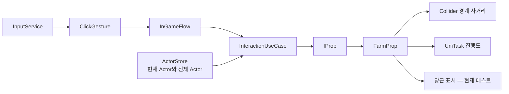

# 2번째 작업 기록

- 작업 인덱스: 2번째
- 현재 단계: 인게임 입력·상호작용 기반 구성 → 밭 작업과 생산 흐름 설계
- 대상 프로젝트: `UmamusumeTracenFarm`
- Unity 버전: 6000.5.7f1
- 작업 구분: 직접 구현과 학습 설계를 구분해 기록

## 오늘의 목표

입력에서 시작한 Hold 제스처를 인게임 상호작용 대상까지 연결하고, 플레이어와 여러 Actor를 식별할 수 있는 기반을 만든다. 밭에서는 캐릭터의 접근 가능 거리를 판정하고 누르는 동안 작업 진행도를 표시한다. 이후 NPC도 같은 밭을 탐색하고 작업할 수 있도록 Farm 상태, 위치, 생산, Store와 Repository의 책임을 설계한다.

장기 프로젝트의 주 기능 구현 목표도 다음 여섯 영역으로 정리했다.

1. 캐릭터
2. 카메라
3. Unity 공식 `Behavior` 패키지를 이용한 AI
4. HUD
5. 인게임
6. 아웃게임

## 오늘의 결과 요약

- Farm 모델과 범용 Repository, FarmService 및 Boot 초기화 기반을 추가했다.
- 입력 이벤트를 Click/Hold 제스처로 해석하고 InGameFlow와 InteractionUseCase로 전달했다.
- ActorId, IActor, ActorStore를 추가해 현재 조작 Actor와 전체 Actor를 구분할 기반을 만들었다.
- UnitGenerator 2.0.0을 설치하고 ActorId를 강타입 정수 ID로 변경했다.
- FarmProp에 Collider 경계 기반 사거리 검사와 UniTask 기반 프로그레스 처리를 작성했다.
- 미래 NPC를 고려해 FarmStore, Repository, FarmService, FarmProp의 책임을 구분했다.
- 현재 C# 프로젝트 빌드는 오류 없이 성공했으며 경고 10개가 남았다.

## 주요 작업 행적

### 1. Farm 모델과 Repository 기반 추가

- 불변 record인 `FarmModel`을 추가했다.
- `ObservableList`와 Dictionary 인덱스를 함께 사용하는 `GenericRepository<TKey, TValue>`를 추가했다.
- `FarmRepository`가 FarmId로 모델을 검색하고 새 모델 스냅샷으로 교체할 수 있게 했다.
- `FarmService.Initialize()`가 초기 Farm 모델을 만들도록 했다.
- `FarmService.GrowFarm()`이 `with` 식으로 새 모델을 만들고 Repository에 반영하도록 했다.
- RootLifetimeScope에서 Repository와 Service를 Singleton으로 등록했다.
- BootContent와 BootService를 통해 초기화 흐름을 구성했다.

현재 구현의 중요한 성격은 모델 인스턴스가 불변이어도 Repository의 최신 스냅샷은 교체된다는 점이다.

```csharp
model = model with { Value = value };
_farmRepository.AddOrReplace(model);
```

### 2. 입력을 제스처로 해석하는 계층 추가

- InputService가 상호작용 입력과 포인터 위치를 Observable로 전달하도록 확장했다.
- ClickGesture가 입력 시각과 위치를 바탕으로 Click/Hold를 구분하는 기반을 만들었다.
- Hold 시작과 종료를 `HoldGesturePayload`로 전달하도록 했다.
- 디버그용 입력 발생기와 카메라를 향하는 Billboard 컴포넌트를 추가했다.
- InGameContent와 InGameFlow를 추가해 제스처 스트림을 인게임 수명주기에 연결했다.

현재 입력 전달 흐름은 다음과 같다.

```text
PlayerControls
→ InputService
→ ClickGesture
→ InGameFlow
→ InteractionUseCase
→ IProp
```

### 3. InteractionUseCase와 IProp 연결

- InteractionUseCase가 Hold 시작 위치로 Camera Raycast를 수행하도록 했다.
- Raycast 대상에서 `IProp`을 찾아 `StartInteract()`와 `StopInteract()`를 호출하도록 했다.
- Hold가 끝날 때 마지막 상호작용 대상을 기억해 중단 신호를 전달하도록 했다.
- `IProp.CanInteract(Vector3 actorPosition)`을 추가해 대상별 사거리 규칙을 맡길 수 있게 했다.

InteractionUseCase는 대상 선택과 시작·종료 흐름을 조정하고, FarmProp은 자신의 형상과 사거리를 판단하는 방향으로 책임을 구분했다.

### 4. ActorStore와 현재 조작 Actor

- `IActor`에 ActorId와 현재 위치를 추가했다.
- Actor의 위치는 별도 Store에 매 프레임 복사하지 않고 Rigidbody의 현재 위치를 조회하도록 했다.
- ActorStore가 `ActorId -> IActor` 관계와 `MyActorId`를 보관하도록 했다.
- InGameFlow가 현재 임시 사용자 Actor를 등록하고 MyActor로 선택하도록 했다.
- InteractionUseCase가 ActorStore에서 현재 Actor의 실제 위치를 얻어 사거리 판정에 사용하도록 했다.

```text
ActorStore
├─ MyActorId
└─ Dictionary<ActorId, IActor>
                    └─ Position → Rigidbody.position
```

학습을 통해 Actor 등록은 생성 성공 직후, 해제는 Despawn 시점에 수행하며 장기적으로 ActorSpawner 또는 ActorFactory가 ID 발급과 등록을 함께 책임지는 방향을 정했다.

### 5. UnitGenerator 기반 ActorId

Unity 프로젝트의 C# 9에서는 C# 10 문법인 `readonly record struct`를 사용할 수 없어 Cysharp UnitGenerator를 선택했다.

- NuGetForUnity CLI로 UnitGenerator 2.0.0을 복원했다.
- 생성기 DLL에 Unity의 `RoslynAnalyzer` 라벨이 적용된 것을 확인했다.
- ActorId를 다음 강타입 struct로 변경했다.

```csharp
using UnitGenerator;

namespace DataType
{
    [UnitOf(typeof(int))]
    public readonly partial struct ActorId
    {
    }
}
```

- C# 9 독립 검증 프로젝트에서 생성자, `AsPrimitive()`, 비교 연산자 생성과 빌드 성공을 확인했다.
- UnitGenerator의 readonly 내부 값은 Unity Inspector 직렬화 대상으로 사용하기 어렵기 때문에 런타임 ID에 사용하는 방향을 정했다.

### 6. FarmProp 사거리 판정

큰 밭에서 중심점까지의 거리를 사용하면 가장자리 바로 옆에서도 멀다고 판정될 수 있음을 확인했다. FarmProp에 상호작용 영역 Collider를 두고 Actor에서 Collider 경계까지의 최단거리를 계산하도록 했다.

```csharp
Vector3 closestPoint = _interactionArea.ClosestPoint(actorPosition);
Vector3 offset = closestPoint - actorPosition;
offset.y = 0f;

return offset.sqrMagnitude
    <= _interactionRange * _interactionRange;
```

- 밭 중심이 아니라 실제 가장자리까지의 거리를 사용한다.
- 농장 게임 규칙에서 높이 차이를 제외하기 위해 Y 성분을 제거한다.
- `bounds.ClosestPoint`가 아닌 `Collider.ClosestPoint`를 사용해 실제 Collider 형상과 회전을 반영한다.
- 장기적으로 밭 중심과 별도로 NPC 및 순간 이동용 ArrivalPoint를 두기로 했다.

### 7. Farm 작업 프로그레스 구현 진행

- FarmProp에 `Image` 기반 진행 표시를 연결했다.
- Hold 시작 시 기존 CancellationTokenSource를 취소·정리하고 새 작업을 시작하도록 했다.
- `FillProgressAsync()`가 매 프레임 진행도를 누적하고 Image의 fillAmount를 갱신하도록 했다.
- Hold 종료 시 CancellationTokenSource를 취소하도록 했다.
- 취소 확인 지점으로 다음 한 줄을 사용했다.

```csharp
ct.ThrowIfCancellationRequested();
```

- 프로그레스가 1에 도달하면 현재 테스트 인덱스의 당근 GameObject를 활성화하는 임시 흐름을 작성했다.
- finally에서 프로그레스 표시를 0으로 되돌리도록 했다.

현재 구현은 동작 검증용 단계이며, 실제 생산 수량과 완료 규칙은 아직 FarmService/FarmStore와 연결되지 않았다.

## 오늘 정리한 시스템 구조

### 현재 인게임 상호작용 구조



### 미래 NPC를 고려한 Farm 구조

Store와 Repository는 다음 의미로 구분하기로 했다.

```text
FarmRepository
└─ FarmModel 스냅샷 로드·저장

FarmStore                     ← 현재 세션 상태의 단일 진입점
├─ 최신 FarmModel
├─ FarmProp/IFarmRuntime 참조
├─ 실제 위치와 ArrivalPoint
├─ 현재 작업 상태
└─ ReservedBy ActorId

FarmService
└─ 생산, 성장, 예약과 상태 전이 규칙

NPC Behavior / HUD / UseCase
└─ FarmStore를 통해 현재 상태 질의
```

NPC는 Repository와 Unity 오브젝트를 각각 직접 뒤지지 않고, 장기적으로 다음과 같은 질의를 사용한다.

```csharp
FarmState? FindNearestAvailable(
    Vector3 actorPosition,
    FarmWorkType workType);
```

여러 NPC가 같은 밭을 선택하지 않도록 `TryReserve(FarmId, ActorId)` 형태의 원자적인 예약도 필요하다.

## 생산 명령과 이벤트에 관한 결론

- “당근을 생산해 달라”는 아직 실행되지 않은 요청이므로 Command 또는 명시적인 Service 호출이다.
- “당근이 생산됐다”는 Repository/Store 변경 성공 후의 사실이므로 Event다.
- 단순 화면 갱신은 Store 또는 Repository의 변경 알림으로 충분하다.
- 퀘스트, 업적, 효과음처럼 생산 행위 자체에 반응하는 소비자가 생기면 `CarrotProducedEvent`를 추가한다.
- 플레이어가 보유한 당근 수량이라면 FarmRepository가 아니라 InventoryRepository가 원본이어야 한다.
- FarmStore는 당근 생산만을 위해 만드는 것이 아니라 NPC, HUD, 순간 이동 등 여러 시스템이 현재 Farm 상태와 위치를 공유해야 하므로 도입한다.

권장 생산 흐름은 다음과 같다.

```text
Farm 작업 완료
→ FarmService.ProduceCarrot(FarmId)
→ FarmStore 상태 전이
→ 필요할 때 Repository 저장
→ CarrotProducedEvent — 실제 소비자가 있을 때만
```

## Git 기록

오늘 확인된 커밋은 세 건이다.

### Repository 모델 추가

- 커밋: `42faf2d364abce8cf51eda103b5cda1043a78182`
- 시각: 2026-08-21 15:39:35 +09:00
- 주요 범위: FarmModel, GenericRepository, FarmRepository, FarmService, Boot 초기화, FarmProp 기본 구조

### 제스처 추가

- 커밋: `38351a167554df4f658fa91b174b95697f210c6d`
- 시각: 2026-08-21 17:57:34 +09:00
- 주요 범위: ClickGesture, 입력 Action 확장, InputDebugger, Billboard, InGameContent와 InGameFlow 기본 구조

### 인게임에 제스처 인식 연동

- 커밋: `d11a9150b54ddaf3b90db028e1e3e65d625420e9`
- 시각: 2026-08-21 19:13:02 +09:00
- 주요 범위: ActorId, IActor, ActorStore, InteractionUseCase, IProp, HoldGesture와 인게임 흐름 연결

UnitGenerator 설치, Actor 위치 연결, Farm 사거리와 프로그레스 구현 및 학습 노트는 이 일지 작성 시점의 작업 트리에 남아 있으며 별도 커밋 여부는 확인되지 않았다.

## 빌드와 검증 결과

### C# 프로젝트 빌드

- 명령: `dotnet build Assembly-CSharp.csproj --no-restore`
- 결과: 성공
- 오류: 0개
- 경고: 10개
- 경과 시간: 약 8.4초

주요 경고:

- Unity 및 NuGet 참조 사이의 `System.ComponentModel.Annotations` 버전 충돌
- `System.Threading.Tasks.Extensions` 버전 충돌
- `FarmProp._activeOnStart`가 할당됐지만 사용되지 않았다는 `CS0414`

### UnitGenerator 검증

- UnitGenerator 2.0.0 패키지 폴더 확인
- 생성기 DLL의 `RoslynAnalyzer` 라벨 확인
- C# 9 독립 컴파일에서 ActorId 생성 코드 확인
- 독립 검증 결과 오류 0개, 경고 0개

### 아직 수행하지 않은 검증

- Unity Play Mode에서 Hold 시작·종료와 프로그레스 취소 검증
- Actor가 사거리 밖일 때 상호작용이 시작되지 않는지 검증
- 밭의 자식 Collider를 클릭했을 때 IProp을 찾는지 검증
- 모든 당근을 생산한 뒤 인덱스 범위 검증
- NPC 및 FarmStore는 오늘 설계만 했으며 구현·실행 검증하지 않음

## 검수에서 발견된 미해결 항목

### 1. InteractionUseCase 상태 전이 순서

현재 `_interact = true`가 IProp 탐색과 `CanInteract()` 성공보다 먼저 설정된다. 대상이 Prop이 아니거나 사거리 밖이어도 Hold 종료 전까지 상호작용 중 상태로 남을 수 있다. 실제 `StartInteract()` 성공 뒤에 true로 바꾸는 편이 안전하다.

### 2. 자식 Collider에서 IProp 탐색

현재 Raycast에 맞은 GameObject에서 `TryGetComponent<IProp>()`를 호출한다. 밭의 Collider가 자식 오브젝트에 있으면 루트 FarmProp을 찾지 못할 수 있으므로 `GetComponentInParent<IProp>()` 또는 명시적인 Target 연결을 검토한다.

### 3. ActorId 발급 정책

현재 InGameFlow는 직렬화된 Actor를 바로 Store에 등록하지만 ActorId를 발급하는 Spawner/Factory가 없다. 기본 ActorId가 중복되면 Dictionary 등록과 MyActor 선택이 잘못될 수 있다. 다음 단계에서 증가형 런타임 ID 발급기와 Spawn/Despawn 등록 수명주기가 필요하다.

### 4. Farm 프로그레스와 UI 결합

현재 FarmProp이 진행 상태와 `Image.fillAmount`를 모두 직접 관리한다. 프로토타입에는 충분하지만 장기적으로 실제 작업 상태는 FarmProp/FarmStore가, 표시는 FarmProgressView가 담당하도록 분리할 필요가 있다.

### 5. 당근 생산의 임시 처리

- 현재 `_testIndex`로 당근 GameObject를 직접 활성화한다.
- 모든 슬롯을 지난 뒤에도 반복이 계속되어 범위 경고가 반복될 수 있다.
- 생산 수량과 FarmModel/FarmStore가 연결되어 있지 않다.
- 생산 성공과 화면 표시의 순서가 보장되지 않는다.
- 실제 구현에서는 FarmService의 상태 변경이 성공한 뒤 View가 반영해야 한다.

### 6. CancellationTokenSource 수명주기

- Start 때 기존 CTS를 취소·Dispose하는 흐름은 들어갔다.
- Stop은 Cancel만 수행하며 GameObject 파괴 시 최종 Dispose 정책을 확인해야 한다.
- UniTaskVoid와 `Forget()`에서 취소 외 예외가 어떻게 보고되는지 확인해야 한다.
- 완료·취소·비활성화에서 프로그레스가 정확히 한 번 정리되는지 Play Mode 검증이 필요하다.

### 7. Repository와 Store 책임 재정리

현재 FarmRepository는 AddOrReplace와 변경 알림까지 제공해 사실상 최신 상태 Store 역할도 수행한다. 새 FarmStore를 도입하면서 같은 성장값과 수량을 양쪽에 보관하면 중복 원본이 생긴다. Repository를 로드·저장 경계로 좁히고 FarmStore를 현재 세션 상태의 단일 원본으로 정리해야 한다.

## 오늘 학습한 핵심 내용

### Actor 위치는 사본보다 실제 원본에서 읽는다

상호작용 사거리만을 위해 모든 Actor 위치를 매 프레임 Store에 복사하면 Rigidbody와 사본 사이의 갱신 순서 문제가 생긴다. ActorStore는 Actor 참조를 보관하고 위치 요청 시 Rigidbody.position을 읽는 것이 단순하다.

### 큰 상호작용 대상은 중심 거리를 사용하지 않는다

큰 밭의 중심점은 플레이어가 실제로 접근한 가장자리와 다르다. Collider.ClosestPoint로 실제 경계까지의 최단거리를 사용해야 대상 크기와 피벗에 영향을 덜 받는다.

### Command와 Event는 시제로 구분할 수 있다

- Command: 반드시 처리되길 원하는 요청
- Event: 이미 성공해서 발생한 사실

생산 요청과 생산 완료를 모두 무조건 방송하면 처리 흐름과 실패 여부가 불명확해질 수 있다.

### Store와 Repository의 구분은 단일 원본이 핵심이다

- Repository는 모델 스냅샷을 로드·저장하는 영속화 경계다.
- Store는 현재 세션에서 여러 시스템이 공유하는 상태의 단일 진입점이다.
- 불변 모델도 새 스냅샷으로 교체되므로 불변이라는 이유만으로 현재 상태가 아닌 것은 아니다.
- 같은 값을 Repository와 Store 양쪽에서 현재 원본으로 관리하면 안 된다.

### NPC를 고려하면 Farm 예약이 필요하다

가장 가까운 작업 가능 밭을 조회하는 것만으로는 두 NPC의 동시 선택을 막을 수 없다. 조회 뒤 `TryReserve(FarmId, ActorId)`가 원자적으로 성공한 NPC만 이동해야 한다.

### CancellationToken은 협력적으로 취소한다

`ThrowIfCancellationRequested()`는 실행 중인 코드를 외부에서 즉시 강제 종료하는 기능이 아니다. 비동기 코드가 해당 줄에 도달했을 때 취소 요청을 확인하고 `OperationCanceledException`을 발생시키는 취소 지점이다.

## 주요 용어

| 용어 | 의미 |
|---|---|
| Hold Gesture | 일정 시간 누르고 있는 입력을 시작·유지·종료로 해석한 제스처 |
| InteractionUseCase | 화면에서 대상을 선택하고 상호작용 시작·종료를 조정하는 계층 |
| ActorId | Actor를 int와 구분해 식별하는 강타입 ID |
| ActorStore | 현재 Actor와 전체 Actor 참조를 ActorId로 조회하는 런타임 저장소 |
| UnitGenerator | 원시 값을 감싸는 강타입 Value Object 코드를 생성하는 Source Generator |
| ClosestPoint | 주어진 위치에서 Collider 실제 형상에 가장 가까운 월드 좌표 |
| FarmStore | 현재 세션의 Farm 상태와 런타임 참조를 제공하는 단일 진입점 |
| Repository | 모델 스냅샷의 로드와 저장을 담당하는 영속화 경계 |
| Command | 아직 실행되지 않았으며 특정 처리자가 수행해야 하는 요청 |
| Event | 처리가 성공한 뒤 이미 발생한 사실을 알리는 메시지 |
| Reservation | 여러 Actor가 같은 작업 대상을 동시에 선택하지 않도록 점유하는 상태 |
| CancellationToken | 비동기 작업에 취소 요청을 전달하는 협력적 취소 신호 |

## 다음 작업 시작 전 확인 순서

1. Unity Play Mode에서 현재 Hold 제스처와 Farm 프로그레스 동작을 재현한다.
2. InteractionUseCase의 `_interact` 설정을 실제 시작 성공 뒤로 옮긴다.
3. 자식 Collider에서도 FarmProp을 찾을 수 있도록 대상 탐색 규칙을 결정한다.
4. ActorId 발급기와 ActorSpawner/Factory의 등록·해제 수명주기를 설계한다.
5. Farm 진행 상태와 FarmProgressView의 표시 책임을 분리한다.
6. `_testIndex` 직접 활성화를 FarmService 생산 요청으로 교체한다.
7. FarmStore를 현재 세션 상태의 단일 원본으로 정의하고 Repository 책임을 로드·저장으로 좁힌다.
8. FarmId, 위치, ArrivalPoint, 작업 상태와 ReservedBy ActorId를 FarmStore에 연결한다.
9. 생산 성공 뒤 당근 View가 갱신되도록 데이터 흐름을 만든다.
10. C# 빌드의 참조 충돌 경고와 `_activeOnStart` 미사용 경고를 정리한다.

## 오늘의 최종 결론

오늘은 입력 제스처에서 실제 Farm 상호작용까지 이어지는 인게임 골격을 만들고, 다중 Actor 식별과 거리 판정 및 작업 진행도의 첫 구현을 추가했다. 기능은 C# 빌드를 통과했지만 현재 Farm 생산은 테스트용 GameObject 활성화 단계이며 데이터 상태와 연결되지 않았다. 다음 작업의 핵심은 ActorId 발급 수명주기와 InteractionUseCase의 상태 전이를 정리한 뒤, FarmStore를 현재 상태의 단일 원본으로 세우고 FarmService를 통해 프로그레스 완료가 실제 생산 상태와 View 갱신으로 이어지게 만드는 것이다.
