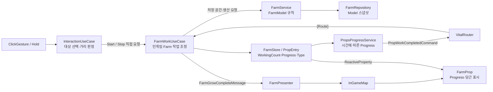

# 4번째 작업 기록

- 작업 인덱스: 4번째
- 작업 날짜: 2026-08-30
- 현재 단계: Progress 완료 메시지 → Farm 생산 → Prop 재작업 상태와 View 갱신 연결
- 대상 프로젝트: `UmamusumeTracenFarm`
- Unity 버전: 6000.5.7f1
- 작업 유형: 사용자 직접 구현, 구조 검토와 학습 설계

## 오늘의 목표

공통 `PropsProgressService`가 작업 완료를 특정 Farm 구현에 직접 의존하지 않고 전달하도록 VitalRouter를 연결한다. Farm 생산 결과를 Model에 반영하고 View에 당근을 표시한 뒤, 생산 가능 여부에 따라 Prop이 다음 작업을 계속하거나 중단하도록 인게임 상태 전이 책임을 정리한다.

## 결과 요약

- `PropsProgressService`에 `ICommandPublisher`를 생성자 주입했다.
- Progress 100%에서 `PropWorkCompletedCommand(PropType, PropId)`를 발행하도록 연결했다.
- VitalRouter의 VContainer 등록, `[Routes]`, `[Route]`, `routing.Map<T>()`의 역할을 확인했다.
- 생산 완료 처리의 수신자를 모델 전용 `FarmService`에서 인게임 조정자인 `FarmWorkUseCase`로 옮겼다.
- `InteractionUseCase`가 Farm 작업 시작·종료를 `FarmWorkUseCase`에 직접 요청하도록 변경했다.
- `FarmWorkUseCase`가 Farm 저장 공간을 확인하고 WorkingCount를 갱신하도록 했다.
- 생산 완료 후 추가 생산이 가능하면 `Working`으로 되돌려 Hold 중 자동 재작업하도록 했다.
- 최대치이면 WorkingCount를 0으로 만들고 다음 작업을 중단하도록 했다.
- `FarmPresenter`가 `FarmWorkUseCase.OnFarmGrowComplete`를 구독해 현재 Model 개수로 Farm View를 갱신하도록 했다.
- 최신 커밋 기준 C# 빌드는 오류 0개로 통과했다.

## 주요 작업 행적

### 1. VitalRouter Publisher와 Handler 연결

VitalRouter의 VContainer 통합을 이용해 `ICommandPublisher`를 `PropsProgressService`에 주입했다. 공통 Progress 시스템은 FarmService를 직접 알지 않고 Prop 종류와 ID만 포함한 완료 메시지를 발행한다.

```text
PropsProgressService
→ ICommandPublisher.PublishAsync
→ PropWorkCompletedCommand(PropType, PropId)
→ VitalRouter
```

`[Routes]`는 수신 클래스에, `[Route]`는 실제 수신 메서드에 사용한다. `routing.Map<FarmWorkUseCase>()`는 발신자 등록이 아니라 해당 Handler를 Router에 연결하는 수신자 등록이다.

`PublishAsync`의 반환 타입은 `ValueTask`다. 기다리지 않을 때 현재 구현은 UniTask로 변환해 Forget한다.

```csharp
_commandPublisher
    .PublishAsync(new PropWorkCompletedCommand(propType, propId))
    .AsUniTask()
    .Forget();
```

이 방식은 Handler 처리 결과를 반환하지 않는다. 예외 추적이 필요하면 `Forget(Debug.LogException)` 형태를 검토한다.

### 2. FarmService에서 FarmWorkUseCase로 완료 조정 책임 이동

초기 구현에서는 `FarmService`가 `[Route]`로 완료 메시지를 받고 Model 변경, 완료 이벤트 발생까지 담당했다. 설계 검토 후 FarmService는 Model과 Repository 처리만 알아야 한다는 경계를 확정했다.

최신 구현에서는 `FarmWorkUseCase`가 다음을 조정한다.

- Farm 작업 시작 전 저장 공간 확인
- WorkingCount 증가·감소
- 공통 완료 메시지 중 Farm 타입만 처리
- FarmService에 실제 생산 요청
- 생산 후 추가 작업 가능 여부 확인
- PropEntry의 Progress와 WorkingType 갱신
- View용 생산 완료 Subject 발행

```text
FarmWorkUseCase
├─ FarmService        ← Model 규칙과 Repository
├─ FarmStore          ← 런타임 PropState
└─ VitalRouter Route  ← 공통 완료 메시지
```

현재 완료 처리의 핵심 상태 전이는 다음과 같다.

```text
생산 성공 + 저장 공간 있음
→ WorkingType.Working
→ Hold 중 다음 Progress 시작

생산 실패 또는 최대치
→ WorkingType.None
→ WorkingCount = 0
→ 작업 중단
```

### 3. InteractionUseCase에서 FarmWorkUseCase 직접 호출

`InteractionUseCase`는 Raycast와 거리 판정으로 현재 대상이 Farm이라는 것을 알고 있으며, 작업 시작 성공과 종료 처리를 명확한 대상에게 요청해야 한다. 따라서 이벤트 대신 `FarmWorkUseCase.StartInteracting()`과 `StopInteracting()`을 직접 호출하도록 변경했다.

```text
Hold Gesture
→ InteractionUseCase
→ FarmWorkUseCase.StartInteracting
→ 저장 공간 확인
→ WorkingCount 증가
```

직접 의존은 무조건 피해야 하는 것이 아니다. 호출 대상이 명확하고 결과·순서가 필요한 요청은 직접 UseCase 호출이 더 명확하다. 이벤트는 여러 선택적 수신자가 이미 발생한 사실에 반응하거나 발신자가 수신자를 몰라야 할 때 사용한다.

### 4. 생산 완료와 View 갱신

생산이 성공하면 `FarmWorkUseCase.OnFarmGrowComplete` Subject가 FarmId를 전달한다. `FarmPresenter`는 FarmService에서 현재 당근 개수를 조회하고 `InGameMap.GrowFarm()`을 통해 `FarmProp.Grow(count)`를 호출한다.

```text
FarmService.GrowFarm
→ FarmModel.Value 증가
→ FarmRepository 교체
→ FarmWorkUseCase 완료 Subject
→ FarmPresenter
→ InGameMap
→ FarmProp 당근 활성화
```

현재 구현은 작업 완료로 증가한 당근을 표시하는 경로에서는 동작한다. 다만 저장 데이터 로드, 수확, 다른 보상 경로처럼 Subject를 거치지 않은 Repository 변경까지 View가 따라가려면 장기적으로 Presenter가 Repository 변경을 구독하고 현재 개수 전체를 렌더하는 구조가 필요하다.

### 5. 완료 후 재작업 규칙

이전 상태에서는 Progress가 Complete에 도달한 뒤 다음 작업으로 돌아가는 주체가 불명확했다. 오늘 구현에서는 FarmWorkUseCase가 FarmService 처리 결과를 확인한 뒤 Prop 상태를 전이한다.

현재 규칙은 다음과 같다.

- Hold 유지 + 추가 저장 공간 존재: 즉시 `Working`으로 복귀해 자동 반복
- 최대 당근 수 도달: WorkingCount를 0으로 만들고 작업 중단
- Hold 종료: `StopInteracting()`이 WorkingCount를 감소

공통 Progress 시스템이 FarmService를 직접 참조하지 않고, FarmUseCase가 모델 처리와 인게임 Prop 상태를 조정하므로 FarmService의 모델 전용 경계가 유지된다.

### 6. 당근 수확 단위 설계

수확 구현은 아직 시작하지 않았지만 다음 방향을 정리했다.

```text
FarmModel.Value
└─ 수확 가능한 당근 개수의 원본

FarmProp의 Carrot GameObject
└─ 밭에 보이는 시각 슬롯

수확된 Carrot Item
└─ 플레이어가 손에 들고 운반하는 별도 소품
```

현재 단계에서는 밭 안의 당근마다 독립 ID, Collider, Model을 만들지 않는다. Farm 하나를 상호작용 대상으로 유지하고, 수확 시 Model 개수를 1 감소시킨 뒤 운반용 Carrot Item을 생성하거나 풀에서 꺼내는 방향이 적합하다. 개별 성장도·품질·위치가 규칙에 영향을 줄 때만 당근별 엔티티를 검토한다.

## 오늘 구성한 시스템 구조



구조의 핵심 책임은 다음과 같다.

| 구성 요소 | 책임 |
|---|---|
| InteractionUseCase | 입력 단계 해석, Raycast, 거리 판정, 대상 기억 |
| FarmWorkUseCase | Farm 작업 시작·종료, 완료 처리, Prop 상태 전이 |
| PropsProgressService | 공통 Prop Progress 계산과 완료 메시지 발행 |
| FarmService | FarmModel 조회·생산·최대치 규칙과 Repository 갱신 |
| FarmPresenter | Farm 생산 결과를 Unity View에 표현 |
| FarmProp | Progress Image와 당근 GameObject 렌더링 |

## Git 기록

오늘 확인된 커밋은 두 건이다.

### 당근 생산 완료 흐름 연결

- 커밋: `ac805f0`
- 메시지: `당근 제작 -> 생산 완료 로직 처리`
- 주요 범위: PropsProgressService Publisher, VitalRouter 등록, FarmService Route, FarmPresenter, InGameMap과 FarmProp View 갱신

### FarmWorkUseCase 도입과 재작업 상태 전이

- 커밋: `e1a01fe`
- 메시지: `인터렉션에서 작업 시작을 FarmWorkUseCase 에서 하도록 변경 생산 완료후 다음 작업 시작할 수 있도록 수정`
- 주요 범위: FarmWorkUseCase 추가, InteractionUseCase 직접 호출, FarmService 모델 책임 정리, 완료 후 Working/중단 상태 처리

질문 학습 노트 변경은 현재 작업 트리에 남아 있으며 별도 커밋되지 않았다.

## 빌드와 검증 결과

### C# 프로젝트 빌드

- 대상: `UmamusumeTracenFarm/Assembly-CSharp.csproj`
- 명령: `dotnet build UmamusumeTracenFarm/Assembly-CSharp.csproj --no-restore`
- 결과: 성공
- 오류: 0개
- 경고: 12개
- 경과 시간: 약 5.27초

직접 작성한 소스 경고:

- `FarmProp._columnCount` 미사용 `CS0414`
- `FarmProp._testIndex` 미사용 `CS0414`
- `FarmProp._activeOnStart` 미사용 `CS0414`

나머지 주요 경고는 Unity 참조 어셈블리와 NuGet 패키지 사이의 버전 충돌이다.

### 확인된 범위

- VitalRouter Source Generator를 포함한 C# 컴파일 성공
- `FarmWorkUseCase` Route와 VContainer 등록 코드 컴파일 성공
- InteractionUseCase → FarmWorkUseCase 의존성 연결 컴파일 성공
- Presenter와 FarmService 연결 컴파일 성공

### 아직 수행하지 않은 검증

- Unity Play Mode에서 Hold 유지 시 당근이 연속 생산되는지 확인
- 최대 15개에서 Progress와 WorkingCount가 중단되는지 확인
- Hold 종료와 생산 완료가 같은 시점에 발생할 때 WorkingCount가 음수 또는 잘못된 상태가 되지 않는지 확인
- FarmWorkUseCase가 InGame LifetimeScope의 Router에 실제 Map되고 Command를 수신하는지 실행 확인
- 당근 수확과 개수 감소 View 렌더링

## 검수에서 남은 항목

### 1. FarmStore.Get의 null 검사

`FarmStore.Get()`은 Dictionary 인덱서를 사용하므로 ID가 없으면 null을 반환하지 않고 예외를 발생시킨다. `FarmWorkUseCase`의 `if (farm == null)` 검사는 현재 유효하지 않은 ID를 방어하지 못한다. 이후 `TryGet` API를 추가하거나 예외 정책을 명확히 한다.

### 2. ActorId별 작업 참여 추적

`StartInteracting`과 `StopInteracting`은 ActorId를 받지만 아직 사용하지 않고 WorkingCount만 증감한다. 중복 Start/Stop이나 여러 Actor가 동시에 작업할 때 정확성을 보장하려면 참여 ActorId 집합으로 확장해야 한다.

### 3. FarmWorkUseCase의 사용하지 않는 Publisher

생성자로 `ICommandPublisher`를 받지만 현재 필드에 저장하거나 사용하지 않는다. FarmWorkUseCase는 완료 메시지 수신자이므로 발행할 메시지가 없다면 생성자 매개변수를 제거한다.

### 4. View 동기화 원본

현재 Presenter는 FarmWorkUseCase의 Subject를 통해서만 갱신된다. 저장 로드와 수확까지 지원하려면 Repository 변경을 구독하고 현재 개수로 전체 슬롯을 동기화하는 방식이 필요하다.

### 5. FarmProp.Grow의 감소 처리와 범위 방어

현재 `Grow(count)`는 0부터 count까지 활성화만 한다. 수확으로 개수가 줄면 기존 당근을 끄지 못하며, Model 최대치와 슬롯 수가 달라지면 인덱스 범위를 벗어날 수 있다. 모든 슬롯을 순회하면서 `i < count` 여부로 활성 상태를 맞추는 렌더가 필요하다.

### 6. InteractionUseCase의 상호작용 성공 상태

`_interact`가 실제 IProp 탐색과 거리 판정 성공보다 먼저 true가 된다. 대상이 Prop이 아니거나 사거리 밖이어도 Hold 종료 전까지 상호작용 중으로 남을 수 있으므로 실제 Start 성공 결과를 받은 뒤 설정하는 방향을 검토한다.

### 7. 완료와 최대치 결과 표현

현재 FarmService는 `GrowFarm()` bool과 별도 `CheckStorageSpace()`를 사용한다. 15번째 생산처럼 이번 적용은 성공했지만 다음 작업은 불가능한 상태를 두 번 조회해 해석한다. 규칙이 복잡해지면 `Applied`, `CanContinue`, 현재 개수를 포함한 결과 타입으로 묶는 것이 안전하다.

## 오늘 학습한 핵심 내용

### 의존성은 무조건 제거하는 대상이 아니다

호출 대상이 명확하고 결과와 순서가 필요한 요청은 UseCase를 직접 호출하는 편이 읽기 쉽다. InteractionUseCase가 Farm 작업을 선택한 뒤 FarmWorkUseCase를 호출하는 의존 관계는 현재 범위에서 타당하다.

### 이벤트는 요청보다 사실 통지에 적합하다

- 작업을 시작해 달라: 직접 호출 또는 결과가 있는 요청
- Prop 작업이 완료됐다: 공통 시스템에서 도메인 수신자에게 알리는 메시지
- Farm 생산이 성공했다: 이펙트·퀘스트 등 선택적 소비자에게 알리는 이벤트

수신자가 여러 개인지는 중요한 기준이지만, 호출자가 처리 결과를 알아야 하는지가 더 근본적인 판단 기준이다.

### Presenter가 View를 안다고 상태 변경 권한을 갖는 것은 아니다

Presenter가 InGameMap을 보유하는 이유는 FarmProp을 렌더하기 위해서다. 최대치 판단과 Prop 작업 상태 전이를 Presenter에서 수행하면 View가 없는 테스트나 다른 실행 환경에서 게임 규칙이 멈춘다.

### FarmService는 Model 경계를 유지한다

FarmService는 FarmModel과 Repository만 처리하고 FarmStore, WorkingType, FarmProp을 모른다. FarmWorkUseCase가 모델 처리 결과와 인게임 Prop 상태 사이를 조정한다.

### 당근 View와 수확 Item은 다른 객체다

밭에 보이는 당근 슬롯은 Model 개수를 표현하는 View다. 수확되는 순간 플레이어가 들 수 있는 Carrot Item으로 분리하며, 개별 당근의 상태가 게임 규칙에 필요해질 때만 독립 엔티티로 승격한다.

## 주요 용어

| 용어 | 의미 |
|---|---|
| ICommandPublisher | VitalRouter에 Command를 발행하는 인터페이스 |
| Routes / Route | Source Generator 기반 Handler 클래스와 수신 메서드를 지정하는 Attribute |
| Map | Handler를 Router에 연결하는 수신자 등록 |
| FarmWorkUseCase | Farm 작업 요청, 생산 완료, Prop 상태 전이를 조정하는 인게임 응용 계층 |
| WorkingType | None, Working, Complete로 표현하는 Prop 작업 단계 |
| Auto Repeat | Hold가 유지되고 생산 가능하면 완료 후 다음 Progress를 즉시 시작하는 규칙 |
| Presenter | Model/상태를 Unity View에 투영하는 표현 계층 |
| Request | 반드시 처리되어야 하며 호출자가 결과를 필요로 할 수 있는 요청 |
| Event | 처리가 끝난 뒤 발생한 사실을 선택적 수신자에게 알리는 메시지 |

## 다음 작업 시작점

1. Unity Play Mode에서 Hold 유지 시 자동 재작업과 최대치 중단을 직접 검증한다.
2. `FarmStore.Get()`에 `TryGet`을 추가하고 FarmWorkUseCase의 무효 ID 처리를 수정한다.
3. FarmWorkUseCase 생성자의 사용하지 않는 `ICommandPublisher`를 정리한다.
4. ActorId별 참여자 집합을 도입할 시점을 결정하고 중복 Start/Stop을 방어한다.
5. InteractionUseCase가 Start 성공 결과를 받은 뒤 `_interact`와 `_lastProp`을 확정하도록 흐름을 정리한다.
6. FarmPresenter를 Repository 변경 기반 전체 렌더로 바꾸고 `FarmProp.Grow(count)`가 감소도 반영하도록 한다.
7. 수확 규칙을 정하고 `FarmService`의 당근 감소 API와 운반용 Carrot Item 생성을 설계한다.
8. `FarmModel.Value`를 `ReadyCarrotCount`처럼 의미가 드러나는 이름으로 변경한다.
9. 공통 Prop이 늘어날 때 `FarmStore`를 `PropStore`로 바꿀지 결정한다.

## 오늘의 최종 결론

오늘은 공통 Progress 완료를 VitalRouter로 전달하고, FarmWorkUseCase가 FarmService의 모델 처리와 런타임 PropState 전이를 조정하도록 구조를 발전시켰다. 작업 완료 후 저장 공간이 남아 있으면 Hold를 유지한 채 자동으로 다음 생산을 시작하고, 최대치에서는 작업을 중단하는 코드까지 추가했다. 최신 C# 빌드는 성공했다. 다음 작업은 Play Mode에서 상태 전이를 검증하고, Repository 기반 View 동기화와 당근 수확 흐름을 구현하는 것이다.
