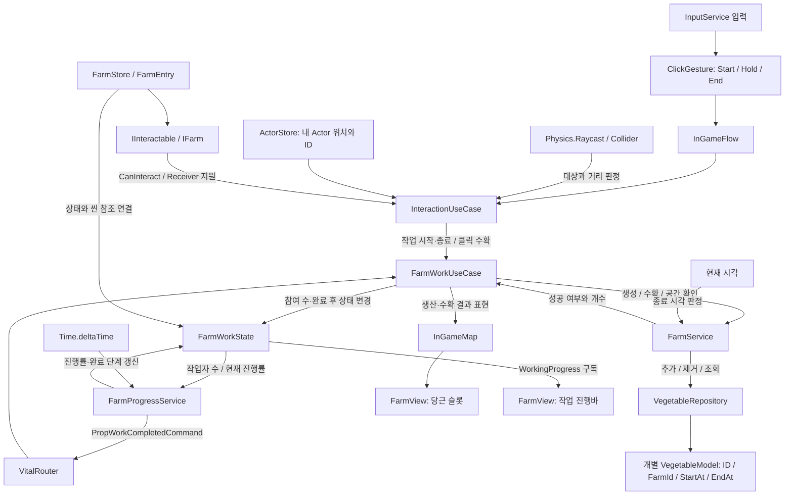

# 5번째 작업 기록

- 기록 범위: [4번째 작업 기록](./4번째_작업_기록.md) 이후부터 이번 기록 작성 시점까지.
- 기준 커밋: 4번째 일지 추가 커밋 `345e55f` 이후. 마지막 확인 커밋은 `99b669c`이며 이후 작업 트리의 편집도 포함한다.
- 대상: `Project/UmamusumeTracenFarm`, Unity 6000.5.7f1.
- 기록 성격: 마지막 일지 이후의 진행 기록. 지정된 보관 위치인 `daily`에 저장한다.
- 근거: Git 이력, 현재 소스, 유형별 학습 노트, 이번 대화의 변경·검증 결과. 날짜 대신 커밋과 작업 순서로 이력을 구분한다.
- 작업 방식: 기능 구현은 사용자 중심으로 진행했고, IFarm/FarmView/FarmEntry 명칭·폴더 정리는 AI에 위임하여 수행했다. 이번 기록 작성에서는 게임 코드와 패키지를 변경하지 않았다.

## 이번 기간의 변화

4번째 작업 기록에서는 작업 완료 Command를 받아 밭에 당근을 생산하고 Presenter를 통해 화면에 표시하는 흐름까지 구성했다. 이후 클릭 수확을 추가하고, FarmWorkUseCase가 화면 갱신도 조정하도록 단순화했다. 채소 수량은 개별 VegetableModel을 조회하는 방식으로 바뀌었다.

상호작용 대상이 밭·소품·건물 등으로 늘어날 가능성을 검토하면서 공통 상호작용과 대상별 기능을 구분했다. 기존 IProp을 IFarm으로 좁히고, 액터의 밭 작업 상태와 작물의 자동 성장 시간을 분리하는 방향을 정했다. 현재는 일부 명칭과 폴더 변경이 진행 중이며, 60초 성장과 전체 상호작용 일반화는 완료되지 않았다.

## 확인 가능한 작업 이력

| 순서 | 근거 | 작업과 의미 |
|---|---|---|
| 1 | `b80b5f4` | Click/Hold Receiver를 추가하고 입력 단계에 따른 행동 분기 구성 |
| 2 | `b667b54` | 클릭 수확과 남은 당근 수에 따른 화면 갱신 추가 |
| 3 | `fe3e130` | FarmPresenter 제거, FarmWorkUseCase에서 InGameMap 호출로 연결 |
| 4 | `99b669c` | VegetableModel/VegetableRepository 도입, 개별 채소로 수량 관리 |
| 5 | 대화와 작업 트리 | IInteractable 분리, IFarm/FarmView/FarmEntry 변경, Unity 참조 보존 확인 |
| 6 | 현재 소스 | FarmProgressService, FarmWorkState/IFarmWorkState 이름 및 State/Store 폴더 적용 확인 |
| 7 | 설계 검토 | 심기 작업과 60초 자동 성장 분리, 역할별 InGame 폴더 구성 정리 |

미커밋 변경에는 스테이징된 내용과 추가 편집이 함께 존재한다. 커밋 완료와 작업 트리 반영을 구분한다.

## 1. Click과 Hold를 같은 대상에서 처리

### 기존 문제와 변경

밭에 작업과 수확이 함께 생기면서 상호작용을 Hold 하나로 해석할 수 없게 됐다. 대상이 IClickGestureReceiver와 IHoldGestureReceiver를 선택적으로 구현하도록 구성했다. 현재 FarmView는 두 인터페이스를 모두 구현한다.

ClickGesture는 입력을 Start/Hold/End와 누적 시간으로 전달한다. InteractionUseCase가 대상 선택, 거리 판정, 입력 지원 여부, 현재 대상 보관을 담당한다.

- Start: Raycast로 대상을 찾고 CanInteract를 확인한 뒤 대상을 보관한다.
- Hold: 대상의 임계시간에 도달하면 밭 작업 시작을 요청한다. 현재 FarmView의 임계시간은 0.5초다.
- End: Hold가 시작됐다면 작업 종료를 요청하고, 시작되지 않았으며 Click을 지원한다면 수확을 요청한다.
- 종료 처리 뒤에는 대상과 세션 플래그를 정리한다.

### 핵심 판단과 남은 부분

Click/Hold는 입력 방식이고 수확/심기는 게임 행동이다. 하나의 대상이 두 입력 방식을 지원할 수 있으므로 소품 상속 계층을 Click형과 Hold형으로 나누지 않는다.

현재 `_interact`는 실제 StartInteracting 호출 전에 true가 되고, StartInteracting은 성공 여부를 반환하지 않는다. 저장 공간 부족 등으로 실제 참여가 거절돼도 입력 세션은 시작된 것으로 남을 수 있다. 시작 성공과 세션 상태를 일치시키는 작업은 남아 있다.

상세: [상호작용 시스템](../categories/상호작용_시스템.md), [입력 시스템](../categories/입력_시스템.md).

## 2. 클릭 수확과 View 갱신

수확 입력은 FarmWorkUseCase.Harvest를 거쳐 FarmService.HarvestVegetable로 전달된다. 성공하면 남은 채소 개수를 조회하고 InGameMap.HarvestFarm을 통해 FarmView.Harvest를 호출한다.

FarmView.Harvest는 전체 슬롯을 순회하여 남은 개수에 해당하는 슬롯만 활성화한다. 이전 일지에 남아 있던 수확 후 개수 감소 표현은 코드에 추가됐다. 운반 가능한 당근 아이템 생성이나 손 소켓 장착까지 구현된 것은 아니다.

현재 화면은 채소 모델의 개수를 슬롯 활성 상태로 나타낸다. 개별 VegetableModel과 특정 시각 슬롯을 연결하는 구조는 아직 없으므로, 당근마다 다른 성장 외형이나 진행바를 표시하려면 개체 식별과 슬롯 대응을 별도로 정해야 한다.

## 3. Presenter 통합과 책임 경계

### 구조 변화

이전에는 FarmWorkUseCase의 Subject를 FarmPresenter가 구독하여 화면을 갱신했다. `fe3e130` 커밋에서 FarmPresenter를 제거하고 FarmWorkUseCase가 InGameMap을 직접 호출하도록 바꿨다.

현재 경계는 다음과 같다.

- FarmService: 채소 생성·수확·저장 공간 등 Model/Repository 규칙.
- FarmWorkUseCase: 작업 참여 변경, 생산·수확 요청, 다음 작업 여부와 화면 갱신 조정.
- InGameMap/FarmView: 밭 씬 객체 연결과 슬롯·진행바 표현.

### 선택 이유와 제한

현재 InGame UseCase를 Unity 콘텐츠 조정자로 사용하는 범위에서는 직접 View 호출이 간단하다. 대신 FarmWorkUseCase는 Unity 독립 계층이 아니며, 표현 교체나 독립 테스트의 경계는 이전 Presenter 구조와 달라졌다. FarmService의 Model 처리 책임은 유지한다.

완료·수확 Subject 선언과 사용하지 않는 Publisher 생성자 인자가 일부 남아 있다. Repository 변경만으로 화면이 자동 복원되는 구조도 아직 아니므로 로드·외부 변경 시 동기화는 후속 과제다.

관련 판단: [아키텍처 노트](../../../../docs/study-notes/categories/architecture.md).

## 4. 수량에서 개별 채소 모델로 전환

VegetableModel은 UniqueId, FarmId, StartAt, EndAt을 보유한다. VegetableRepository는 문자열 UniqueId를 키로 사용한다. FarmService가 새 모델을 추가하고 FarmId로 필터링해 수량과 공간을 계산하며, RootLifeTimeScope에 Repository 등록도 추가됐다.

이 변화로 같은 밭에 서로 다른 시각에 심어진 채소를 개별 데이터로 표현할 수 있게 됐다. 현재 최대 저장 수량은 15개이며 성장 중인 채소도 공간을 차지한다.

새 채소 ID는 GUID 문자열로 발급한다. 새 개체에는 새 ID를 부여하되 같은 개체를 갱신하거나 복원할 때는 유지한다는 수명 기준을 검토했다. 저장·복원 동작 자체를 검증한 것은 아니다.

FarmId 강타입 선언도 추가됐지만 현재 밭 모델·메서드 인자에는 int 사용이 남아 있다. 전체 API 전환 완료로 기록하지 않는다.

## 5. IProp의 범위를 IFarm으로 축소

### 문제와 설계 판단

농장, 앉을 수 있는 소품, 건물을 모두 Prop으로 묶으면 초기화 데이터와 작업 상태를 공통으로 강제하게 된다. 공통으로 필요한 것은 상호작용 대상이라는 계약이고, 초기화와 실제 행동은 대상별 책임이다.

- IInteractable: 대상 ID와 현재 상호작용 가능 여부 판정.
- IFarm: 밭의 계약. 현재는 IInteractable을 상속한다.
- Click/Hold Receiver: 입력 지원 여부와 Hold 시작 임계시간.

이 인터페이스 분리는 대상 선택을 일반화한 단계다. 현재 InteractionUseCase의 실행 경로는 여전히 FarmStore와 FarmWorkUseCase로 연결된다. 의자 착석이나 건물 행동이 구현됐거나 자동으로 분기되는 것은 아니다.

### 위임한 명칭·폴더 변경

| 변경 전 | 변경 후 |
|---|---|
| IProp | IFarm |
| FarmProp | FarmView |
| PropEntry | FarmEntry |
| Props 폴더 | Farms 폴더 |
| Props/IInteractable | Interaction/IInteractable |
| InGameMap의 FarmProp / _farmProp | FarmView / _farmView |

호출부, 네임스페이스, 에디터의 밭 생성 코드, 로컬 csproj의 파일 경로를 함께 수정했다. 기존 폴더·스크립트 `.meta` 5개는 이동 전후 바이트 단위로 동일함을 확인했다. 씬·프리팹의 스크립트 GUID를 유지했고, `_farmView`에는 이전 직렬화 필드명 `_farmProp`을 읽는 FormerlySerializedAs를 적용했다.

PropType은 아직 IFarm과 완료 Command에서 사용한다. 이를 제거하려면 완료 처리 경로도 정리해야 하므로 단순 명칭 변경 시에는 유지했다.

## 6. 밭 작업과 당근 성장의 분리

### 구체화한 요구

액터가 밭에서 작업하면 심기가 진행되고, 심어진 당근은 액터 없이도 성장하여 1분 뒤 수확할 수 있어야 한다.

| 항목 | 밭 작업 | 작물 성장 |
|---|---|---|
| 진행 조건 | 액터의 작업 참여 | 심어진 뒤 시간 경과 |
| 상태 단위 | 현재 공동 작업 구조에서 밭당 하나 | 채소 개체마다 하나 |
| 완료 의미 | 심기 작업 완료 | 수확 가능 |
| 액터가 떠났을 때 | 현재 규칙은 작업 진행 초기화 | 기존 성장 시각 유지 |
| 원본 데이터 | FarmWorkState | VegetableModel의 시작·종료 시각 |

같은 밭에 10초 간격으로 두 당근을 심으면 성숙 시각도 각각 달라진다. 세 번째 심기 작업을 진행하면서 기존 두 작물이 성장할 수 있으므로 하나의 진행률에 합치지 않는다.

### 현재 구현과 목표의 차이

현재 FarmService.GrowFarm은 종료 시각을 약 2초 뒤로 설정한다. HarvestVegetable은 EndAt이 현재 시각 이하인 채소만 수확한다. 따라서 화면에는 바로 나타나지만 수확 가능 시각을 검사하는 코드는 이미 있다. 목표인 60초는 아직 반영되지 않았다.

현재 시작·종료 시각을 만들 때 DateTime.Now를 각각 읽는다. 시작 시각을 한 번 읽고 성장 기간을 더하는 구성이 더 명확하다. 실제 시계 기준이므로 게임 일시정지에도 성장 시간은 흐른다. 게임 시간과 실제 시간 중 어느 기준을 사용할지는 별도 판단 사항이다.

수확 가능 여부만 필요하다면 요청 시 종료 시각을 검사하면 된다. 성장률은 경과 시간 / 전체 성장 시간으로 계산할 수 있어 채소마다 별도의 비동기 루프를 만들 필요는 없다. 성숙 순간의 자동 처리가 생기면 그때 성장 갱신기를 검토한다.

### 명칭과 상태 변경 현황

- PropsProgressService는 현재 FarmProgressService로 변경됐다.
- 작업과 성장을 더 분명하게 구분하는 이름으로 FarmWorkProgressService를 제안했으나 적용된 이름은 FarmProgressService다.
- PropState/IPropState는 현재 FarmWorkState/IFarmWorkState로 변경됐다.
- PropWorkingType, WorkingType, FarmEntry.Payload 등 이전 명칭은 남아 있다.
- 작업 상태 enum을 FarmWorkStatus로 좁히고 Complete를 심기 완료로 해석하는 방향을 검토했다.

같은 진행바를 표시한다는 이유로 모든 작업을 하나의 상태나 서비스로 묶지 않는다. 소요 시간은 데이터로, 완료 행동은 대상별 UseCase로 분리할 수 있다. 공통화의 판단 기준은 중단·재개·반복·참여자에 따른 실제 진행 규칙이다.

## 7. InGame 폴더의 역할 기준

Model/Repository로 나눈 기반 구조와 일관되게 InGame도 역할을 먼저 구분하는 방향을 검토했다.

| 역할 | 제안 위치 | 기록 시점의 적용 상태 |
|---|---|---|
| 콘텐츠 작업 상태 | State | FarmWorkState/IFarmWorkState 파일 이동 확인. 네임스페이스는 아직 InGame.Payload |
| 실행 중 등록·조회 | Store | FarmStore/ActorStore 이동 및 Store 네임스페이스 확인 |
| 상태와 씬 참조를 묶는 항목 | Store/FarmEntry | 아직 Farms/FarmEntry에 위치 |
| 밭 씬 표현·계약 | View/Farms | 아직 Farms에 위치 |
| 맵 표현 | View/InGameMap | 아직 InGame 루트에 위치 |
| 공통 상호작용 계약 | Interaction | IInteractable 배치 확인 |
| 작업 조정·진행 갱신 | UseCase | 현재 구조 유지 |
| 전체 조립·진입 | InGame 루트 | InGameContent/InGameFlow 유지 |

FarmEntry는 순수 상태가 아니라 작업 상태와 IFarm 참조를 연결하는 등록 항목이다. 이를 보관하는 FarmStore 옆에 두는 방향이 적절하다. State 종류가 많아지기 전에는 State/Farms 같은 하위 폴더를 미리 늘리지 않는다.

## 현재 책임과 데이터 흐름

아래는 기록 시점 소스를 기준으로 한 흐름이다. State 폴더의 네임스페이스 정리와 View 폴더 이동은 아직 완료되지 않았다.

Repository 변경이 View에 직접 전달되는 화살표는 현재 없다. 작물 성장용 개별 진행바와 60초 설정 역시 이 구현 흐름에 추가된 상태가 아니다.

## 검증 이력과 한계

| 확인 시점 | 항목 | 결과와 범위 |
|---|---|---|
| IFarm/FarmView/FarmEntry 정리 시점 | 게임 C# 빌드 | `dotnet build Assembly-CSharp.csproj --no-restore` 오류 0개, 경고 12개 |
| 같은 시점 | 에디터 C# 빌드 | `Assembly-CSharp-Editor.csproj`, BuildProjectReferences=false로 오류 0개, 경고 3개 |
| 같은 시점 | Unity 직렬화 참조 | 이동한 .meta 5개 동일. 씬·프리팹은 클래스 식별자만 변경되고 객체·스크립트 참조는 유지됨 |
| 같은 시점 | 명칭과 공백 검사 | 이전 IProp/FarmProp/PropEntry 타입·네임스페이스 잔존 검사 및 git diff --check 통과 |
| 이후 FarmProgressService/State/Store 변경 | 최신 구조 검증 | 이번 기록에서 소스 확인만 수행. 재빌드하지 않음 |
| 전체 기간 중 이 기록에서 확인한 범위 | Unity Editor/Play Mode | 실행 검증 결과를 확보하지 못함 |

빌드 경고는 어셈블리 참조 충돌과 미사용 필드 관련이었다. 최초 샌드박스 빌드는 SDK 캐시 경로 접근 문제로 실패했고, 권한을 확보한 재실행은 성공했다. 이 환경 문제를 소스 오류로 기록하지 않는다.

검증 자료: [에디터 빌드 로그](../../../working/farm-naming/editor-build.log), [.meta 비교 결과](../../../working/farm-naming/meta-check.json). 게임 빌드 결과는 대화 도구 출력과 기존 유형별 노트에 남아 있다. 이 성공 결과를 이후 편집까지 포함한 최신 빌드 성공으로 확대하지 않는다.

## 이전 일지의 미해결 항목 재점검

| 이전 항목 | 현재 상태 |
|---|---|
| 클릭 수확과 개수 감소 렌더 | 코드 구현 확인. Play Mode 검증은 별도 |
| Presenter의 View 동기화 | Presenter 제거, UseCase 직접 호출로 구조 변경. Repository 기반 자동 복원은 미구현 |
| FarmStore.Get의 null 방어 | Dictionary 인덱서가 그대로이므로 무효 ID 예외 문제는 남음 |
| ActorId별 참여 추적 | Count 증감 방식과 TODO가 남음 |
| 작업 시작 성공과 세션 상태 일치 | 대상 탐색 이후로 상태 확정 위치는 개선됐지만 실제 시작 성공 반환과 연동되지 않음 |
| Grow의 범위 방어 | Grow는 활성화만 하며 슬롯 수 초과 방어가 없음. 수확 감소는 별도 Harvest가 처리 |
| 미사용 Publisher와 Subject | FarmWorkUseCase에 일부 남음 |
| FarmModel 수량 이름 개선 | 수량 필드 대신 VegetableRepository의 개체 수를 조회하도록 변경 |
| FarmStore를 PropStore로 일반화 | 밭 계약을 IFarm으로 좁히는 방향으로 설계 변경. FarmStore 유지 |

## 학습할 내용과 주요 용어

| 주제 | 이번 작업에서의 의미 |
|---|---|
| 상호작용 계약 | 대상이 입력을 받을 수 있는 기능과 현재 실행 가능 여부를 표현 |
| 입력 세션 | 누르기부터 떼기까지 동일 대상과 시작된 행동을 추적 |
| 작업 상태 | 액터 참여와 함께 변하는 밭의 진행 데이터 |
| 개체 수명 | 개별 채소 ID와 성장 시각이 생성부터 수확까지 유지되는 범위 |
| 도메인 규칙 | 공간 제한, 성장 종료 판정, 생산·수확 적용 |
| 콘텐츠 조정 | 입력·작업 상태·도메인 요청·표현을 연결하는 UseCase 책임 |
| 직렬화 호환 | 파일·필드 이름 변경 후에도 기존 씬과 프리팹 참조를 읽는 성질 |
| 공통화 기준 | 동일한 UI 모양보다 진행 규칙과 상태 수명의 일치 여부 |

학습의 중심은 모든 대상에 하나의 인터페이스를 적용하는 것에서, 실제로 공유하는 기능과 서로 다른 상태 수명을 구분하는 방향으로 이동했다. 폴더 이동은 그 책임을 드러내는 수단이며 계층 독립성이나 실행 정확성을 자동으로 보장하지 않는다.

## 다음 작업 시작점

1. 진행 중인 명칭·폴더 정리를 마친다. State 네임스페이스, FarmEntry 위치, View/Farms 적용 범위와 남은 Prop 명칭을 확인한다.
2. Unity가 생성하는 프로젝트 파일과 에셋을 갱신한 뒤 최신 구조를 컴파일하고, 씬의 FarmView 참조를 확인한다.
3. 밭 작업 완료와 작물 성장 완료를 구분하여 60초 성장 요구를 구현한다. 실제 시간/게임 시간 기준을 정하고 기존 2초 설정을 교체한다.
4. 액터가 떠나도 이미 심어진 채소의 성장 종료 시각이 유지되는지, 서로 다른 시각에 심은 두 채소가 각각 수확 가능한지 확인한다.
5. Click 단독, Hold 단독, 겸용 대상의 시작·종료를 확인하고, 실제 작업 시작 성공 여부와 입력 세션 상태를 연결한다.
6. 무효 ID 조회와 ActorId별 중복 참여 문제를 작은 단위로 정리한다.
7. 개별 성장 외형이 필요해지는 시점에 VegetableModel ID와 슬롯을 연결한다. 현재 수량 기반 표시와 혼동하지 않는다.

이 목록은 현재 상호작용·밭 작업의 다음 시작점이며 프로젝트 전체의 9단계 이후 계획을 추가로 확정한 것이 아니다.
