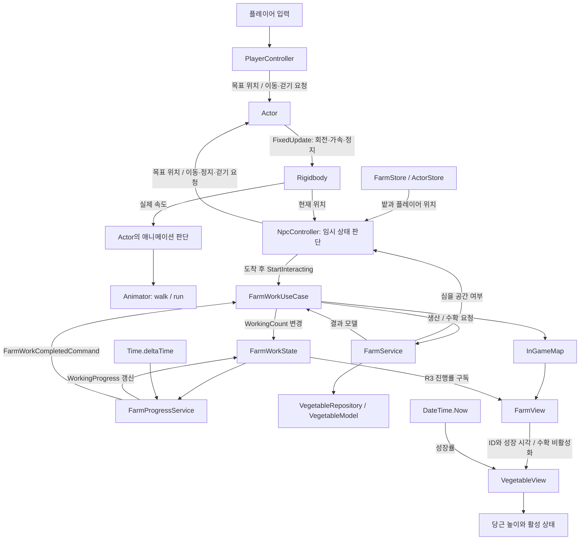

# 6번째 작업 기록

- 기록 범위: [5번째 작업 기록](../daily/5번째_작업_기록.md) 이후부터 현재 확인한 `8a13203`까지.
- 기록 성격: 작업 중간의 진행 기록. 일일 마감 기록은 아니다.
- 근거: Git 커밋, 현재 소스, 기존 학습 노트와 이번 대화에서 수행한 구현·검증 결과.
- 작업 방식: 사용자 구현을 바탕으로 임시 `MoveToPosition` 연결과 당시의 정지 처리를 AI가 구현했다. 이후 추가된 NPC 상태 분기와 플레이어 추적은 현재 소스에서 확인했다. 이번 기록 작성에서는 게임 코드와 씬을 변경하지 않았다.

## 진행 요약과 작업 이력

5번째 기록에서 남아 있던 개별 채소 모델과 화면 슬롯 연결이 추가됐다. 생산 결과인 `VegetableModel`을 View에 전달하고, 각 `VegetableView`가 모델 ID와 성장 시각을 보관한다. 수확도 같은 모델 ID에 대응하는 화면 객체를 비활성화하는 방식으로 바뀌었다.

NPC는 플레이어와 같은 `Actor` 이동 기능을 사용한다. 임시 밭 이동을 먼저 연결한 뒤, 현재는 밭 이동·작업·플레이어 추적 상태를 구분한다. NavMesh와 Behavior Tree는 아직 적용하지 않았다.

| 순서 | 근거 | 변화 |
|---|---|---|
| 1 | `da55609` | VegetableView 추가, 성장 표현과 모델 단위 생산·수확 전달, FarmWorkCompletedCommand 명칭 적용 |
| 2 | 설계 노트 | NPC별 판단과 공통 조회·상태 변경의 책임 분리, NavMesh 이동 후 Behavior Tree 연결 순서 검토 |
| 3 | 이번 대화의 임시 구현 | MoveToPosition에서 Actor API 재사용, 당시 1m 도착 판정과 작업 시작 전 정지 연결 |
| 4 | 임시 구현 검증 | Terra–medium 구현, Sol–high 독립 리뷰 통과, MSBuild 컴파일 성공 |
| 5 | `8a13203` 현재 소스 | AiStatusType, 플레이어 추적, CanInteract 기반 도착 판정, 걷기 요청 추가 |
| 6 | 기록 작성 | 현재 소스와 이전 검증 범위를 대조하고 남은 확인 항목 정리 |

## 개별 채소의 성장과 수확 표현

### 문제와 구조 변화

이전에는 채소 개수에 맞춰 슬롯을 켜고 끄므로 특정 채소의 성장 상태나 수확 결과를 화면 객체와 대응시키기 어려웠다. 현재는 생산·수확 결과에 포함된 `VegetableModel`을 `FarmWorkUseCase → InGameMap → FarmView`로 전달한다.

- `FarmView.Grow`: 비활성 슬롯의 VegetableView를 찾아 StartAt, EndAt, UniqueId를 전달한다.
- `VegetableView.StartGrow`: 모델 정보를 보관하고 객체를 활성화한다.
- `VegetableView.Update`: 실제 시각으로 성장률을 구하고 localPosition.y를 -0.4에서 0까지 바꾼다.
- `FarmService.HarvestVegetable`: EndAt이 현재 시각 이하인 모델을 찾아 Repository에서 제거하고 반환한다.
- `FarmView.Harvest`: 반환된 모델과 UniqueId가 같은 VegetableView를 비활성화한다.

밭 작업 진행과 작물 성장은 서로 다른 시간 흐름이다. FarmProgressService는 작업자 수와 Time.deltaTime으로 작업 진행률을 올리고, 이미 심어진 채소는 DateTime.Now와 자신의 성장 시각으로 성숙 여부를 판단한다. 현재 성장 시간은 **2초**이며, 앞서 검토한 60초 설정은 적용되지 않았다.

### 핵심 코드와 한계

현재 성장 표현의 핵심은 다음과 같다. 완성된 범용 성장 처리의 예제가 아니라 현재 구현을 요약한 것이다.

```csharp
var totalDuration = (_endAt - _startAt).TotalSeconds;
var elapsedDuration = (DateTime.Now - _startAt).TotalSeconds;
return Math.Min((float)(elapsedDuration / totalDuration), 1);
```

성장률의 하한과 0 이하 성장 시간은 방어하지 않으며, 성장 완료 후에도 활성 View의 Update 계산은 계속된다. `FarmView.Grow/Harvest`는 `First`로 슬롯을 찾으므로 빈 슬롯이나 대응 ID가 없으면 예외가 발생할 수 있다. 현재는 슬롯 수와 모델 수가 일치한다는 전제에 의존한다.

## NPC 이동과 행동 분기

### 공통 이동을 재사용한 이유

플레이어와 NPC 모두 실제 이동·회전·애니메이션은 Actor가 담당한다. PlayerController는 입력을, NpcController는 밭 및 플레이어의 위치와 작업 가능 여부를 이동 요청으로 변환한다. NPC에 Rigidbody 제어를 복제하지 않아 같은 이동 특성을 유지한다.

```csharp
private void MoveToPosition(Vector3 position)
{
    _actor.SetAimDirection(position);
    _actor.SetMoveFlag(true);
}
```

목표 설정은 이동 완료를 의미하지 않는다. Actor.FixedUpdate가 이후 물리 틱마다 목표 방향과 가속도를 적용한다. Actor의 목표 접근 정지 거리는 0.2m이며, 밭 작업 가능 판정은 별도의 상호작용 영역을 사용한다.

### 초기 구현에서 현재 코드로 바뀐 부분

| 항목 | 앞서 검증한 임시 구현 | 현재 `8a13203` |
|---|---|---|
| 작업 상태 | `_tempWorking` bool | Idle / MoveToPlayer / MoveToFarm / WorkToFarm enum |
| 밭 도착 판정 | 밭 목표점과 수평 거리 1m | `FarmEntry.CanInteract`를 통해 FarmView 판정 사용 |
| 밭 공간 부족 | 정지 | ActorStore.MyActor를 조회해 플레이어 추적 |
| 이동 속도 선택 | Actor의 기본 이동 플래그 사용 | Update에서 매번 SetWalkFlag(true) 요청 |
| 검증 범위 | 컴파일·독립 코드 리뷰 통과 | 이번 기록에서는 소스 확인만 수행 |

이전 [게임 구성과 학습 순서 노트](../categories/게임_구성과_학습_순서.md)의 임시 이동 절은 초기 구현 당시의 기록이다. 1m 판정과 `_tempWorking` 설명을 현재 구현으로 해석하지 않는다.

### 현재 행동 순서

1. 매 Update에서 걷기를 요청하고 FarmStore의 첫 번째 밭을 조회한다.
2. 밭이 없으면 이동을 해제한다.
3. CheckStorageSpace가 false면 MoveToPlayer 상태로 바꾸고 플레이어의 현재 위치로 이동을 요청한다.
4. 밭에 공간이 있고 이미 WorkToFarm 상태이면 현재 작업을 유지한다.
5. 작업 가능 범위이면 이동을 해제하고 StartInteracting을 한 번 호출한 뒤 WorkToFarm 상태로 바꾼다.
6. 작업 범위 밖이면 MoveToFarm 상태로 바꾸고 밭의 목표 위치로 이동한다.

현재 밭 선택은 첫 항목 하나이며, 모든 밭을 검색해 가능한 대상을 고르는 로직은 아니다. CheckStorageSpace는 심을 공간을 검사하므로 수확 가능한 성숙 작물이 있는지와도 구분해야 한다.

도착 판정은 FarmView의 Collider.ClosestPoint와 상호작용 범위를 사용한다. Actor.Position의 y를 0으로 만든 뒤 전달하므로 평지에서는 확인하기 쉽지만 높이가 다른 지형에서는 전달 좌표와 판정 기준을 다시 검토해야 한다. `GetInteractionPosition`은 밭 Transform 위치를 기준으로 한 Collider의 최근접점이며 NPC별 접근 지점이나 장애물 우회 경로를 계산하지 않는다.

## 책임과 데이터 흐름



작업 진행률과 채소 성장률은 별개이며, NPC에는 아직 수확·소지·운반 요청 경로가 없다. 플레이어의 클릭 수확은 기존 InteractionUseCase를 통해 FarmWorkUseCase로 전달된다.

## 검증 이력

| 대상 | 결과 | 범위와 제한 |
|---|---|---|
| 초기 MoveToPosition 및 정지 처리 | 독립 리뷰 통과 | 당시 1m 판정과 bool 상태 버전 |
| 같은 시점의 Assembly-CSharp | MSBuild 오류 0, 기존 FarmView 미사용 필드 경고 3 | 기존 Unity 참조 DLL을 별도 검증 출력 폴더에 복사해 빌드 |
| 초기 빌드 환경 | SDK 경로 접근 및 참조 DLL 위치 문제 후 해결 | 소스 오류와 분리. SDK 접근 권한 확보와 참조 DLL 배치 후 성공 |
| 현재 `8a13203` 소스 | 변경 흐름과 관련 API 확인 | 새 빌드 및 실행은 수행하지 않음 |
| 저장된 씬·프리팹 검색 | NPC 스크립트 GUID 참조 없음, Auto Inject 목록 비어 있음 | 에디터의 미저장 상태는 확인하지 못함 |
| Unity Play Mode | 미검증 | 초기 구현과 현재 구현 모두 실제 이동·작업 반복 결과를 확보하지 못함 |

초기 빌드 산출물은 `working/npc-move-build/bin/Assembly-CSharp.dll`이다. 이 결과를 현재 상태 분기까지 검증한 것으로 확대하지 않는다.

## 남은 문제와 학습 포인트

- **참여 수명 관리:** NPC는 작업 시작만 호출하고 떠날 때 StopInteracting을 호출하지 않는다. 현재 공간이 가득 차면 생산 완료 처리에서 WorkingCount를 0으로 만들지만, 이동 취소·컴포넌트 비활성화·대상 변경 전반의 참여 해제를 해결한 것은 아니다.
- **상태와 실제 참여의 일치:** WorkToFarm 상태이면 거리 재검사보다 먼저 반환한다. 외부 힘으로 밀려나거나 밭의 참여 수가 다른 경로로 초기화되면 NPC 상태와 실제 작업 참여가 어긋날 수 있다. StartInteracting의 성공 반환과 ActorId별 참여 관리도 아직 없다.
- **조회 의미:** GetAvailableVegetable은 EndAt이 현재보다 큰 성장 중 작물을 조회한다. 수확 가능 조회로 사용하려면 실제 용도와 조건을 먼저 맞춰야 한다. 현재 NPC는 이 메서드를 사용하지 않는다.
- **주입과 등록:** 저장된 코드의 InGameContent에는 NpcController 등록이 없다. 씬의 Auto Inject 설정과 Actor 참조, MyActor 등록 시점을 확인해야 한다. MoveToPlayer에는 MyActor null 방어가 없다.
- **이동과 경로 탐색의 차이:** 현재는 목표를 향한 직접 이동이다. NavMesh는 경유점·도달 가능 경로를 담당하고 Behavior Tree는 행동 선택·중단·전이를 담당하도록 이후 학습에서 분리한다.
- **모델과 View 식별:** UniqueId로 수확 모델과 화면 객체를 맞출 수 있게 됐다. 로드 후 복원, 모델과 슬롯 개수 불일치, 성장 완료 갱신 종료는 별도로 확인해야 한다.

## 다음 작업 시작점

1. NPC의 Actor·Rigidbody·Animator 참조를 확인하고 같은 NPC의 PlayerController를 비활성화한다. InGameContent의 Auto Inject Game Objects에 NPC를 등록한다.
2. 최신 코드를 컴파일한 뒤 장애물 없는 평지에서 밭 이동 → 범위 진입 → 정지 → 작업 진행을 확인한다.
3. 밭이 가득 찼을 때 플레이어 추적, 수확으로 공간이 생겼을 때 밭 복귀와 작업 재참여를 확인한다. WorkingCount가 중복 증가하거나 NPC가 떠난 후 남는지 함께 관찰한다.
4. 서로 다른 시각에 심은 두 채소의 성장 높이와 성숙 전·후 수확 결과, 수확된 모델과 비활성 슬롯의 ID 대응을 확인한다.
5. 현재 임시 상태 전이와 참여 해제를 정리한 다음 NavMesh로 장애물을 우회하는 이동을 학습한다. 이후 Behavior Tree 연결을 검토한다.

관련 기록: [5번째 작업 기록](../daily/5번째_작업_기록.md), [게임 구성과 학습 순서](../categories/게임_구성과_학습_순서.md), [상호작용 시스템](../categories/상호작용_시스템.md), [캐릭터 이동과 물리](../categories/캐릭터_이동과_물리.md).
